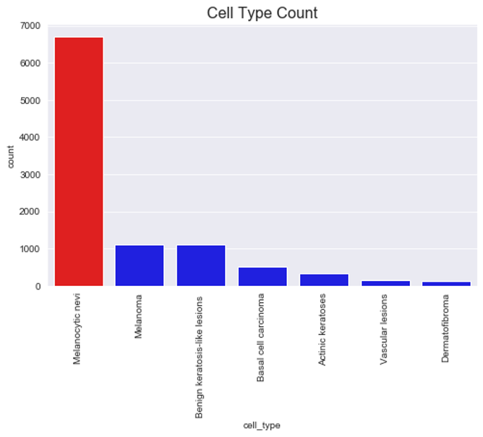

# CNN Dermoscopic Image Classification: HAM10000   
[MyPracticumVideo](https://youtu.be/FpzQE9GftNc)    
     
## Introduction     
Skin cancer is the number one type of cancer affecting people in the U. S., accounting for at least 9,500 diagnoses each day (The Skin Cancer Foundation [TSCF], 2019).  Estimated skin cancer cost is 8.1 Billion a year: However, about 18,000 people die in the U. S. from skin cancer each year (TSCF, 2019).  Early treatment of skin cancer improves patient survival rate, which is additionally dependent on early stage detection (TSCF, 2019).  According to the European Society for Medical Oncology [ESMO] (2018) a study using a convolutional neural network (CNN) outperformed experienced dermatologists at melanoma detection from images at a rate of 95% for the CNN and 88.9% for the dermatologists (ESMO, 2018).
  
## System     
This project includes Python 3.7 using Keras with TensorFlow backend in a Jupyter Notebook.  This notebook was run on a laptop with a GTX 1070 GPU.  The available GPU, GPU:0 with 6372 MB memory) -> physical GPU (device: 0, name: GeForce GTX 1070, compute capability: 6.1), significantly limited building a much deeper model. 
  
## Model Build Objectives
There are three main objectives of this project involving building a Keras sequential image classification model on a laptop.
But first, let’s look at the issues this data and available resources presents.
The major problem is that the data is heavily biased in favor of a single class (Melanocytic nevi) of seven, which accounts for 67% of the data, shown in Figure 1.  Other factors include similarities in color and a relatively small dataset for image classification.  In addition, the model architecture and subsequent performance is affected by image down-sizing [from 600x400 to 160x120] resolution and a limited amount of resource memory (i.e., compute power). 

The objectives are: 
1) to significantly reduce or eliminate overfitting, 
2) reach at least 80% test accuracy without violating the first objective, and 
3) build a model that can work with limited resources while reaching objective 2.  

The model is to be run using a GTX 1070 GPU with 6.1 GB of available memory.  Although I could use the CPU in which there is considerably more memory, time is limited and testing a wide variety of model builds using the CPU is not a viable alternative.
  
## Dataset
The dataset used for this image classification project was a collection of 10015 dermoscopic images sized at 600x450 pixels and the metadata file downloaded from the Skin Cancer MNIST: HAM10000 Kaggle website (Mader, 2019). The images folders are also available at the Harvard Dataverse website (Tschandl, 2018). There were seven classes of previously cropped and centered skin lesion images: Actinic keratoses (akiec), basal cell carcinoma (bcc), benign keratosis-like lesions (bkl), dermatofibroma (df), melanoma (mel), melanocytic nevi (nv), and vascular lesions (vasc) (Tschandl, Rosendahl, & Kittler, 2018).  Digital dermatoscope images produce moderately low noise levels and relatively uniform background illumination (Kinyanjui, 2019).  

## Exploratory Data Analysis
Although exploratory data analysis (EDA) performed was wide ranging, the primary consideration was the relative differences between cell type counts.  The Cell Type by Count graph, Figure 1: Cell Type Count, showed that the dataset was highly imbalanced with one class of seven, Melanocytic nevi, filling 67% of the space.  Between the imbalance bias, resizing the image size from 650x450 to 160x120 (a 93%-pixel count reduction), and image color similarity this classification problem was an especially difficult exercise regarding model tweaking and test accuracy performance.
### Figure 1: 6.1 Cell Type Count

## Methods
 Classification of the skin lesion images involved resizing the images, data standardization, creating train, test, and validations sets, reshaping images to 3 dimensions, CNN model architecting, and data augmentation.  Image resizing necessitated reducing the input size from 600x450 to 160x120 to account for compute limitations. Creating train, test, and validations sets involved splitting the data into train and test sets and then creating a validation set from the resulting train set.  Data split was train/test 0.80/0.20 and validation spit was train/validate was 0.87/0.13 from the remaining train set, Table 1: Data Shape.  Pixel standardization (mean and standard deviation, feature-wise in this case) was chosen over normalization (scale range 0-1) and pixel centering (zero mean) because it is typically the most commonly applied method for this type of data (Brownlee, 2019a). 
### Table 1: Data Shape 

## The Test Model   
This project also included a test model, which was provided primarily as an example starting point.  The test model involved running with and without data augmentation. The final model architecture decision occurred after many trial and error experiments.  In addition, experimentation with the learning rate reduction and data augmentation in the test model showed that examples set by others were either close to or dead on the choices made here. It was obvious from the test model performance that a different model architecture would be necessary.
  
## The Final CNN Model (Model 4) Architecture
Model 4 input included 160x120 3 channel images resized from 600x450. This final model included 9 convolutions in 4 groups, a 2 dense group, flatten, and the output layer. Conv Group 1 had three convolutions: A slightly different approach than usual.  Conv Layers Groups 2, 3, and 4 each contained two convolutions. In addition, the input convolution (conv layer 1) had 16 kernel filters while the following two convolutions in group 1 each included 32 kernel filters.  For the dense layers 1024 kernels worked better than larger or smaller sized kernels.  Each convolution layer included 3x3 filters, which is best to discern small and local features (Ramesh, 2018).  Also included were BatchNormalization, MaxPooling2D, and Dropout layers. An added kernel regulizer l2 set at 0.001 to help manage overfitting was added to each Conv2D and to each Dense layer. Adam optimizer produced better results than other optimizers.

## Model 4 Scores 
Primary metric was the CNN Score.  CNN score is also referenced as the test score or as the classification score.  Other metrics included area under curve (AUC), f1 scores, and a confusion matrix.  An AUC may have been a better indicator of how well of a fit the model is than the CNN score (Brownlee, 2019b).  CNN scores were very close to one another. The best test score was 80.38% (run #4) and the best AUC Score was 0.7872 (run #5).  The average difference between CNN and AUC scores was 2.6 %. Shown in Table 2: Model 4 Scores below were scores for separate runs and the average for each score type.  Score types included CNN (test) score, AUC Score, and f1 scores.  Important f1 scores for this project were model accuracy, melanoma, and basil cell (carcinoma). 
### Table 2: 10.1 Table 1

## Conclusion
This model generally performed well, although there was a slight overfit.  It is likely that the accuracy result could have been improved by using a larger sized image input, a much greater number of images, a much larger compute capability, and possibly using a transfer learning model or the weights, such as from ResNet, Inception, or VGG.  A truer representation of the model accuracy and fit may have been to combine and average the CNN average score and the AUC average: (0.8014 + 0.7805)/2 = 0.7909.  In addition, samples for each class could be more similar in distribution to produce a better accuracy without overfitting.

## Distribution Imbalance: Potential ad hoc solution 
#### See [RebalanceTable](https://github.com/wmadisonf/CNN-Dermoscopic-Image-Classification_HAM10000/blob/master/Rebalance%20by%20Age.txt)
    I noticed in 6.7 'Count Plot: Cell Type Count by Age' that:
        'akiec', 'bcc', 'bkl', and 'mel' occurred far more frequently at and after age 55 and
        'nv' occured more frequently before age 55
    Although it would reduce the size of the data, using only the data for ages >= 55
        would decrease the imbalance and potentially improve results 
    For example:
        Original data size is 10015
        Original ratio of melanoma to Melanocytic nevi was 17%
        Original ratio of basil cell carcinoma to Melanocytic nevi was 9%
        Data size after filtering age >=55 is 4611
        Ratio of melanoma to Melanocytic nevi after filtering age >=55 improves to 38% 
        Ratio of basil cell carcinoma to Melanocytic nevi after filtering age >=55 improves to 20% 
### Figure 2: 6.7 Cell Type Count by Age

## Appendix
    Things that did not do well or improve scores
         Data Augmentation: A wide range of augmentations were attempted 
            Scaling
            Shearing
            Different rotation variations made little difference
            Vertical flip in tandem with Horizontal flip
            Using ranges (e.g., [0.1,0.7]) caused model to under perform
         Model Architecture
            Gausian Noise
            SGD Optimizer
            he_normal initializer
            regularizer l1
            MaxPooling2D(2,2)
            regularizer l2 greater than 0.01
         Class Weights
            Adjusting class weights to compensate for the imbalance 

    Things that worked best
         Data Augmentation
            Rotation - best at 20
            width shift - best at 0.1
            height shift - best at 0.1
            zoom range - best at 0.1
            horizontal flip
         Model Architecture
            Adam optimizer at defaults
            regularizer l2
            Batch Normalization
            MaxPooling2D()
            Dropout(0.25)
## References  
  
Brownlee, J. (2019a) How to normalize, center, and standardize image pixels in Keras. Retrieved from https://machinelearningmastery.com/how-to-normalize-center-and-standardize-images-with-the-imagedatagenerator-in-keras/

Brownlee, J. (2019b). How to use ROC curves and precision-recall curves for classification in Python. Retrieved from https://machinelearningmastery.com/roc-curves-and-precision-recall-curves-for-classification-in-python/

European Society for Medical Oncology. (2018, May 28). Man against machine: AI is better than dermatologists at diagnosing skin cancer. ScienceDaily. Retrieved January 14, 2020 from www.sciencedaily.com/releases/2018/05/180528190839.htm

Kinyanjui, N. M. (2019). Estimating skin tone and effects on classification performance in dermatology datasets. Retrieved from http://krvarshney.github.io/pubs/KinyanjuiOCCPSV_fmlh2019.pdf

Mader, K. (2019). Skin cancer MNIST: HAM10000. Retrived from https://www.kaggle.com/kmader/skin-cancer-mnist-ham10000/download

Ramesh, S. (2018). A guide to an efficient way to build neural network architectures- Part II: Hyper-parameter selection and tuning for convolutional neural networks using Hyperas on Fashion-MNIST. Retrieved from https://towardsdatascience.com/a-guide-to-an-efficient-way-to-build-neural-network-architectures-part-ii-hyper-parameter-42efca01e5d7 2/

The Skin Cancer Foundation. (2019). Skin cancer facts & statistics. Retrieved from https://www.skincancer.org/skin-cancer-information/skin-cancer-facts/

Tschandl, P.  (2018). The HAM10000 dataset, a large collection of multi-source dermatoscopic images of common pigmented skin lesions. https://doi.org/10.7910/DVN/DBW86T, Harvard Dataverse, V1, UNF:6:IQTf5Cb+3EzwZ95U5r0hnQ== [fileUNF]

Tschandl, P., Rosendahl, C, & Kittler, H.  (2018). The HAM10000 dataset, a large collection of multi-source dermatoscopic images of common pigmented skin lesions. Sci. Data 5:180161 doi: 10.1038/sdata.2018.161.     

    
   
